# GitHub Copilot Metrics for Microsoft Fabric

This repository provides a deployment and analytics pattern for collecting
GitHub Copilot usage metrics, processing them through a Microsoft Fabric
medallion architecture, and serving governed insights through a Direct Lake
semantic model and Power BI report.

## How it works

The solution has two cooperating planes:

1. **Bootstrap and deployment:** setup scripts and the `ghcp-metrics` Python
   CLI use Azure Identity to create or reuse Azure Key Vault resources, deploy
   Fabric items, publish the project wheel to a Fabric Environment, run an
   initial backfill, and reconcile a daily schedule.
2. **Runtime analytics:** the Fabric pipeline runs Bronze, Silver, and Gold
   notebooks in order. Bronze downloads GitHub Copilot metric reports into
   OneLake, Silver validates and normalizes them into Delta tables, and Gold
   builds reporting-ready aggregates consumed by the Direct Lake semantic
   model and Power BI report.

Credentials are not stored in repository configuration. The GitHub token is
stored in Azure Key Vault and read at runtime by the effective Fabric identity.

See [How the repository works](docs/how-it-works.md) for the detailed
architecture, data flow, deployment lifecycle, security boundaries, and
operational model.

## Diagram formats

- [SVG](docs/diagrams/github-copilot-metrics-architecture.svg)
- [PNG](docs/diagrams/github-copilot-metrics-architecture.png)
- [Mermaid source](docs/diagrams/github-copilot-metrics-architecture.mmd)

> [!NOTE]
> The architecture documentation was derived from the implementation assets on
> the `vevarunsharma-ghcp-fabric-starter` branch. At generation time, the
> default `main` branch contained only the seed README.
