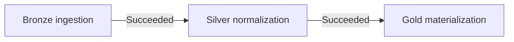
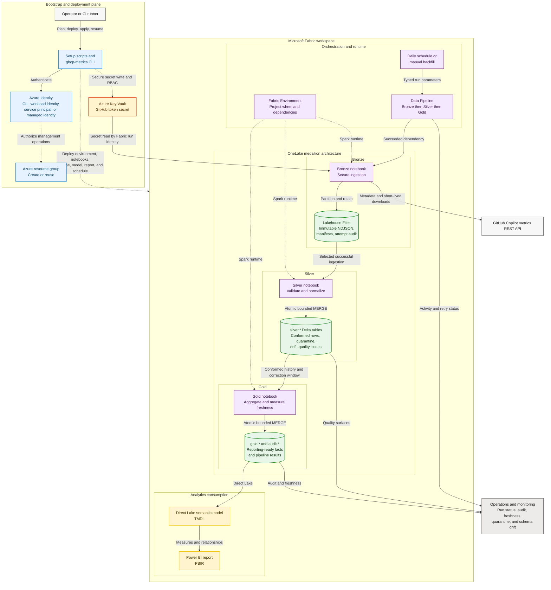

# How the repository works

This repository implements a secure, repeatable path from GitHub Copilot usage
reports to a Microsoft Fabric analytics experience. It combines a Python
package and deployment CLI, Azure Key Vault, Microsoft Fabric deployment
assets, a OneLake medallion architecture, a Direct Lake semantic model, and a
Power BI report.

> [!NOTE]
> This document was derived from the implementation assets on the
> `vevarunsharma-ghcp-fabric-starter` branch. At generation time, the default
> `main` branch contained only the seed README.

## Architecture diagram

Download the [PNG](diagrams/github-copilot-metrics-architecture.png) or edit
the [Mermaid source](diagrams/github-copilot-metrics-architecture.mmd).

The diagram follows Azure architecture guidance by separating external,
management, security, processing, data, analytics, and operations concerns.
Dashed connectors represent deployment or control-plane relationships. Solid
connectors represent runtime data flow.

## Architecture at a glance

| Layer | Main repository assets | Responsibility |
| --- | --- | --- |
| Configuration | `config/config.example.yml` | Stores names, scopes, schedules, and deployment preferences; never credentials. |
| Bootstrap and deployment | `scripts/setup.*`, `src/copilot_metrics_fabric/bootstrap.py`, `azure_bootstrap.py`, `deployment.py` | Validates prerequisites, plans changes, creates or reuses Azure resources, deploys Fabric items, and resumes safely after failures. |
| Collection | `github_client.py`, `bronze.py`, `fabric/notebooks/ingest_bronze.ipynb` | Calls GitHub's one-day report endpoints and immediately streams short-lived downloads into immutable Bronze storage. |
| Transformation | `silver.py`, `silver_spark.py`, `build_silver.ipynb` | Validates, normalizes, deduplicates, quarantines invalid records, and records schema drift. |
| Analytics | `gold.py`, `gold_spark.py`, `build_gold.ipynb` | Produces daily adoption, feature, language, IDE, repository, team, rolling-user, and freshness outputs. |
| Orchestration | `fabric/pipelines/copilot_metrics_orchestration.DataPipeline/` | Runs Bronze, Silver, and Gold sequentially with bounded retries and typed runtime parameters. |
| Semantic model and report | `assets/powerbi/GitHubCopilotMetrics/` | Defines the Direct Lake TMDL model, measures, relationships, and PBIR report pages. |
| Quality and operations | `audit.pipeline_run_results`, `silver.silver_quarantine`, `silver.silver_schema_drift`, `gold.data_freshness_daily` | Exposes stage outcomes, invalid data, source evolution, and reporting freshness. |

## 1. Bootstrap and deployment plane

The recommended entry point is `scripts/setup.ps1` on Windows or
`scripts/setup.sh` on macOS and Linux. The script creates a virtual
environment, installs the Python package, and invokes the `ghcp-metrics`
commands.

The bootstrap workflow is intentionally split into read-only planning and
confirmed application:

1. `init` creates a non-secret YAML configuration.
2. `validate` checks configuration and deployable assets locally.
3. `bootstrap plan` discovers Azure and Fabric resources without writing.
4. `bootstrap apply` displays the ordered change set and, after confirmation,
   creates or reuses the configured resources.
5. `bootstrap status` reports resumable state.
6. `bootstrap resume` skips completed phases and continues after transient
   failures.

The deployment code resolves Fabric workspaces and items by exact display name
and type. It rejects duplicate names rather than selecting an arbitrary
resource. Definitions are content-hashed, and credential-free state files
track item IDs, hashes, completed phases, backfill jobs, and schedules so
repeated runs are idempotent.

### Resources deployed or configured

- An Azure resource group, when creation is enabled.
- An RBAC-enabled Azure Key Vault, when creation is enabled.
- Least-privilege Key Vault roles for the bootstrap writer and Fabric runtime
  identity.
- A Microsoft Fabric workspace, when creation is enabled.
- A schema-enabled Lakehouse.
- A published Fabric Environment containing the project wheel and runtime
  dependencies.
- Bronze, Silver, and Gold notebooks bound to the Lakehouse.
- A Data Pipeline with resolved workspace and notebook IDs.
- A Direct Lake semantic model.
- A Power BI report bound to the semantic model.
- An optional initial backfill and one project-managed daily schedule per
  configured scope.

The repository does not purchase Fabric capacity, create alert rules, activate
production RLS mappings, or infer a primary-team allocation. Those remain
operator-owned governance decisions.

## 2. Identity and secret flow

Azure management and Fabric deployment use credentials supported by Azure
Identity, such as Azure CLI login, workload identity, a service principal, or
managed identity. No Azure or Fabric bearer token is committed.

The GitHub token follows a separate data-plane path:

1. Bootstrap prompts through hidden input or receives an injected secret
   provider.
2. The token is validated against the configured GitHub scope.
3. Bootstrap writes it to Azure Key Vault without placing the value in YAML,
   command arguments, state files, pipeline definitions, or logs.
4. The effective Fabric run identity receives **Key Vault Secrets User**.
5. The Bronze notebook receives only the Key Vault URI and secret name and
   reads the value at runtime.

Signed GitHub report URLs are short-lived. Bronze streams them immediately and
does not persist complete URLs or credentials in manifests or audit records.

## 3. Runtime data plane

### Schedule and pipeline

A managed daily schedule or an operator-triggered backfill starts the Fabric
Data Pipeline. The pipeline passes typed values such as scope, report types,
date range, schema names, Key Vault URI, and secret name.

The stages are connected by `Succeeded` dependencies:

If a stage fails, it writes a sanitized failure audit when possible, re-raises
the exception, and prevents downstream stages from starting. Bronze has three
bounded retries; Silver and Gold each have two.

### Bronze: immutable source retention

Bronze requests the configured organization or enterprise one-day reports for
the selected dates. The default report set is:

- entity;
- users;
- user-teams; and
- repositories.

For each report, Bronze validates the metadata response and signed HTTPS
download URLs, streams NDJSON into OneLake, and calculates a SHA-256 content
hash. Files are partitioned by scope kind, scope slug, report type, report day,
and ingestion ID.

Content-identical reruns are deduplicated. Changed late-arriving telemetry is
retained under a new ingestion ID. A GitHub `204 No Content` response becomes a
successful no-data manifest rather than a pipeline failure.

### Silver: conformed and quality-aware data

Silver selects the appropriate successful Bronze ingestion and expands nested
GitHub structures into explicit daily tables. It:

- applies explicit schemas;
- records source path, ingestion ID, ingestion time, and record hash;
- resolves duplicate upsert keys deterministically;
- writes invalid records to `silver.silver_quarantine`;
- records unknown source paths in `silver.silver_schema_drift`; and
- records duplicate and validation warnings in
  `silver.silver_quality_issues`.

Bounded output is replaced with one atomic Delta `MERGE`, including deletion of
rows removed by a source correction. It does not use delete-then-append.

### Gold: reporting-ready metrics

Gold reads conformed Silver history and produces daily outputs for entity,
team, repository, feature, language, IDE, user state, rolling adoption, and
data freshness.

Important metric rules include:

- rates use ratios of summed numerators and denominators;
- zero or absent denominators return null rather than zero;
- rolling 7-day and 28-day users are distinct users active anywhere in the
  inclusive window;
- source-reported weekly and monthly values remain daily snapshots and are not
  summed;
- many-to-many team rows are marked non-additive; and
- `user_adoption_current` is rebuilt from complete available user history
  through the latest reporting day.

Gold also uses an atomic bounded Delta `MERGE` and appends stage results to
`audit.pipeline_run_results`.

## 4. Windowing and late corrections

Daily mode replaces a trailing Gold window ending yesterday. Backfill mode
replaces an explicit inclusive start and end date.

Bronze and Silver receive additional history before the Gold replacement start
using `calculation_lookback_days`, which defaults to 27 days. This gives Gold
enough history to calculate rolling 28-day metrics while still replacing only
the requested reporting window. An optional `earliest_date` prevents the
ingestion window from requesting dates before data is available.

Lookback-only Bronze dates can reuse successful manifests. Dates inside the
Gold replacement window are refreshed so late GitHub corrections remain
discoverable.

## 5. Direct Lake and Power BI

The semantic model uses Direct Lake over Gold Delta tables. TMDL assets define
tables, relationships, and measures; PBIR assets define the report. The
starter report includes:

- Executive Overview;
- Team Adoption;
- Developer Experience;
- Repository Impact; and
- Data Quality.

The report excludes user-level Gold tables, but aggregate slices can still be
sensitive. No production RLS role is active by default. A deny-all scope
filter template is provided as a starting point, and production deployments
must supply a governed principal-to-scope mapping and test it with Power BI
**View as**.

## 6. Audit, monitoring, and operations

Every notebook appends a success or failure row to
`audit.pipeline_run_results`, including the run ID, stage, status, effective
scope and date window, validation status, and sanitized details.

Operators should monitor:

1. Fabric pipeline and notebook activity status.
2. `audit.pipeline_run_results`.
3. `gold.data_freshness_daily`.
4. Silver quarantine, schema drift, and quality issue tables.
5. Power BI data-quality measures.
6. Key Vault access, token lifetime, Fabric capacity health, and Direct Lake
   guardrails.

Alerting is recommended for pipeline failure, missing report days, increasing
quarantine volume, and new schema-drift paths, but alert resources are not
deployed by this repository.

## 7. Design characteristics

- **Separation of planes:** deployment operations are visually and
  operationally distinct from runtime data flow.
- **Least privilege:** the secret writer and runtime reader use separate Key
  Vault roles.
- **No secret configuration:** YAML stores only resource names and the Key
  Vault secret name.
- **Idempotent deployment:** discovery, content hashes, and state files make
  retries safe.
- **Immutable raw data:** changed source content is retained rather than
  overwritten.
- **Deterministic correction handling:** Silver and Gold use bounded atomic
  merges.
- **Explicit quality surfaces:** invalid rows and unknown fields are visible,
  not silently discarded.
- **Decoupled consumption:** Direct Lake and PBIR assets can evolve without
  embedding credentials or environment-specific IDs in source.

## Mermaid source

The complete editable diagram is stored at
`docs/diagrams/github-copilot-metrics-architecture.mmd` and is reproduced
below.

